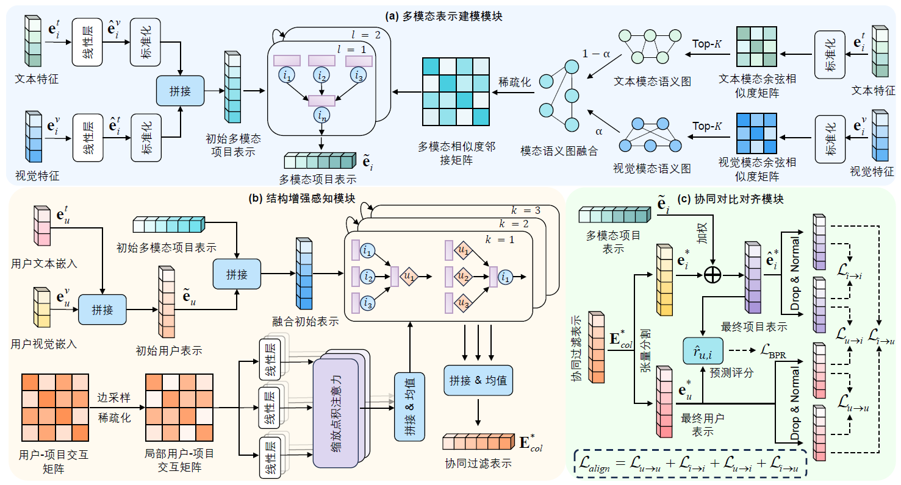
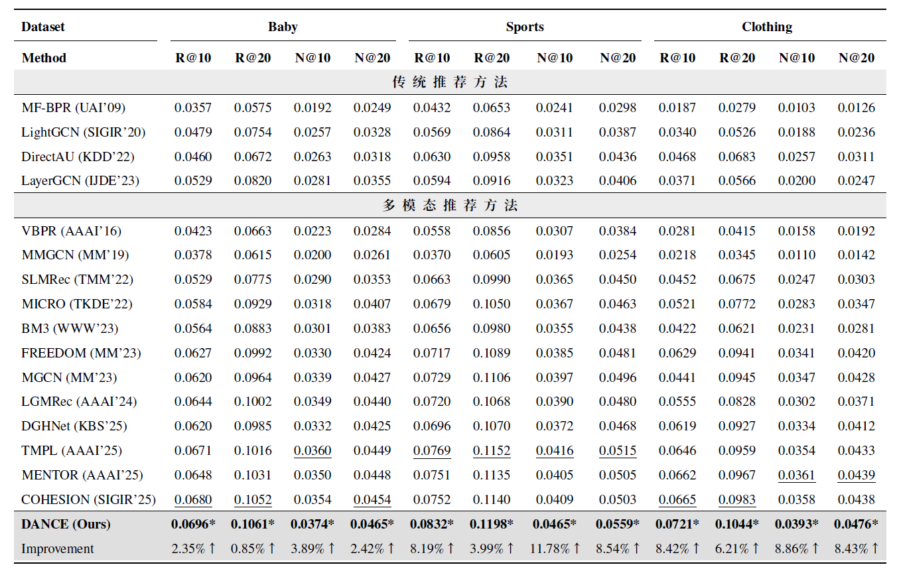

# DANCE: Dual Alignment with Contrastive Enhancement for Multimodal Recommendation

## Introduction

This is the Pytorch implementation for our paper: Dual Alignment with Contrastive Enhancement for Multimodal Recommendation

## Overview

The structure of our model is available for viewing in the following:
<p align="center">
   
</p>


### Enviroment Requirement

- python == 3.8

- Pytorch == 1.10.2

You can install all requirements with pip install -r requirements.txt.

### Datasets

We provide three processed datasets: Baby, Sports and Clothing,each containing a combination of textual and image information.Here, we directly present their embeddings.
You could download all the datasets from Google Drive: [Baby/Sports/Clothing](https://drive.google.com/drive/folders/1BxObpWApHbGx9jCQGc8z52cV3t9_NE0f). 

### Training

1. Put your downloaded data (e.g. `Sports`) under ``DANCE/data/Sports`` dir.
2. Enter `src` folder with ```cd .../DANCE/src```
3. run with`python main.py -m FREEDOM -d baby`
4. You may specify other parameters in CMD or config with `configs/model/DANCE.yaml` and `configs/dataset/*.yaml`.

### Performance Comparison
<p align="center">
   
</p>

